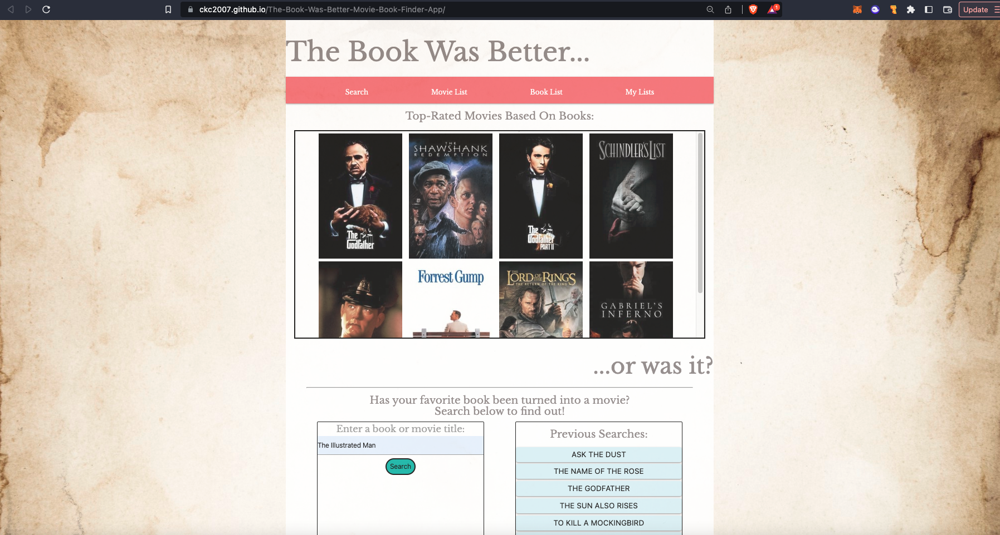
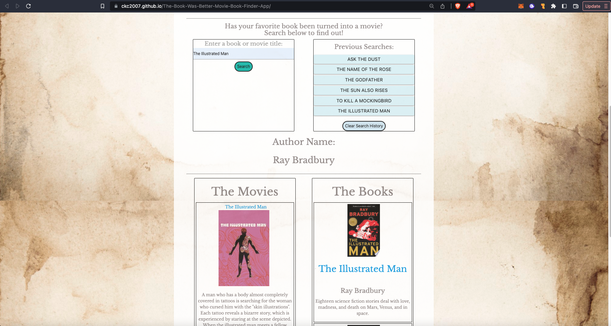
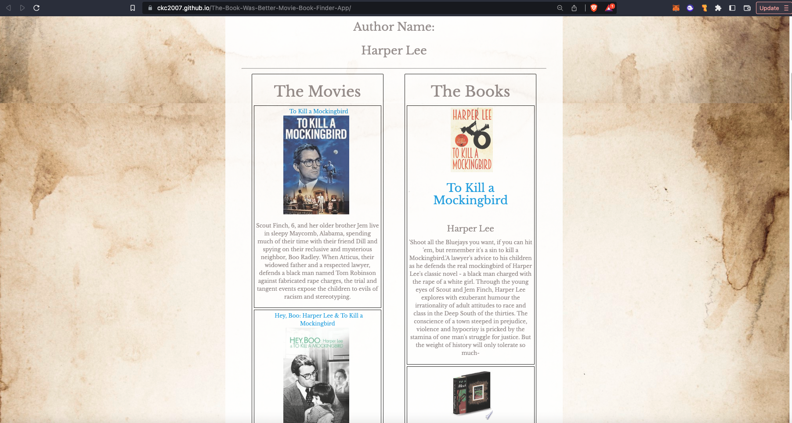

# The Book Was Better

```
The Book was Better is a web application that allows book lovers to easily search and find if their favorite stories have made the leap from paper to film.
```

## Description

```
As bootcamp students, we were given a project assignment to create an interactive front-end application. As a team, we developed an application called The Book was Better. Users will be greeted on load with a selection of trending film adaptations. A user can then search to see if a book they've read has been made into a movie. If it has, then they will be presented with a list of other movies that this author has been a part of, as well as a list of similar movies.

This application uses The Movie DB API and Google Books API
```

[themoviedb.org](https://www.themoviedb.org/)

[developers.google.com/books](https://developers.google.com/books)

## User Story

```
AS A person who has read a book
I WANT an interactive front-end application
SO THAT I can quickly and easily search for film adaptations of books I have read
```

## Acceptance Criteria

```
GIVEN I am using a book/movie finder app with a text input for a book title
WHEN I search for a book title
THEN I am presented with a list of films adapted from that book, and a list of books that match the title criteria
WHEN I click on the search button
THEN my search is saved in a list and my search is displayed in "The Movies" and "The Books" columns.
WHEN I click on one of my saved searches
THEN I am again presented with a list of film adaptations and an acompanying booklist that match the search criteria
WHEN I refresh the page
THEN the search display is cleared, but my search history persists
WHEN I do a search
THEN I am presented with The title of the film, A movie poster and a blurb;
I am also presented with a book list with the book title, Author, and blurb/summary
When I click on either the movie poster or the book image
THEN I am taken to The Moive DB page for that film, or the Google Books page for that book
WHEN I click on a navigation link
THEN I am taken to the relevant section of the page
```

## Getting Started

```
enter a book title to find out if a film adaptation exists for it
```

## Deployed Application

```
Link to the live site:
```

[https://ckc2007.github.io/The-Book-Was-Better-Movie-Book-Finder-App/]

```
The following shows a screenshot of the deployed "The Book Was Better..." web application:
```





### Dependencies

\*Web Browser

### Installing

- No installation required - currently browser only

### Executing program

- Open the application by visiting [The Book Was Better](https://www.https://ckc2007.github.io/The-Book-Was-Better-Movie-Book-Finder-App/)

- Use the navigation bar to quickly scroll to where you want to go

- Enter title and author name to search for any existing film adaptations.

## Authors

Charlene Parker - [AdrenaRose](https://github.com/adrenarose)

Christopher Chorney - [ckc2007](https://github.com/ckc2007)

Arturo Barron - [ArturoB10](https://github.com/arturob10)

## Version History

- 0.1
  - Initial Release

## License

This project is licensed under the MIT License - see the LICENSE.md file for details

## Acknowledgments

- Background Image by [rawpixel]("https://www.freepik.com/free-photo/vintage-textured-watercolor-paper-background_15599882.htm#query=parchment&position=7&from_view=keyword&track=sph") on Freepik
- [Materialize](https://materializecss.com/getting-started.html)
- [TheMovieDB API](https://developers.themoviedb.org/3/getting-started/introduction)
- [Google Books API](https://developers.google.com/books)
